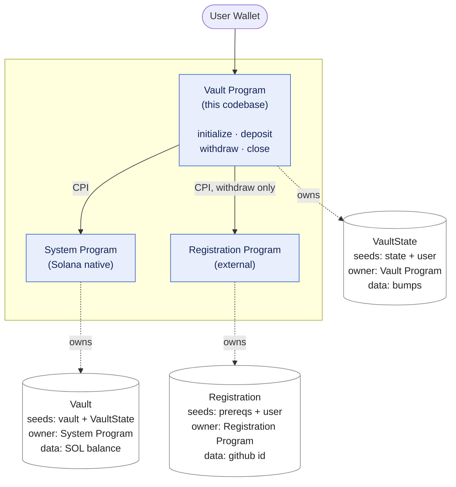
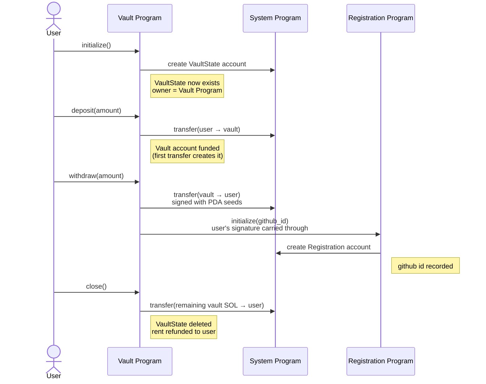

# Vault Program — Architecture

## 1. Components and accounts

**Accounts involved**

| Account | Seeds | Owner | Holds |
|---|---|---|---|
| `VaultState` | `state` + user | Vault Program | the two PDA bumps |
| `Vault` | `vault` + VaultState | System Program | the deposited SOL |
| `Registration` | `prereqs` + user | Registration Program | the github id |

`VaultState` and `Vault` are deliberately separate: one is bookkeeping the
Vault Program owns and can write to; the other is a plain SOL holder the
System Program owns, so it can be freely credited and debited. `Registration`
belongs to an entirely different program — the Vault Program only supplies
the accounts and the github id, it never writes that account itself.

## 2. Instruction flow

**Purpose of each instruction**

- **`initialize`** — opens a vault for the caller: creates `VaultState` and
  derives (but does not yet create) the `Vault` address.
- **`deposit(amount)`** — moves `amount` SOL from the user into `Vault`.
- **`withdraw(amount)`** — moves `amount` SOL from `Vault` back to the user,
  and — the extension added for this challenge — registers the user with
  the Registration program in the same instruction.
- **`close`** — drains whatever SOL remains in `Vault`, deletes `VaultState`,
  and refunds its rent to the user.

**State over time**: no vault → `VaultState` created, empty → funded by
deposits → reduced by withdrawals (and, on the first withdrawal, the
Registration account is created alongside it) → drained and deleted by
`close`.

## 3. Why `withdraw` needs two separate authorizations

`withdraw` is the only instruction that makes two outbound calls, and each
proves permission differently:

- **Moving SOL out of `Vault`** — `Vault` is a PDA with no private key, so
  the Vault Program re-supplies the exact seeds that derived it to prove
  it's the legitimate authority.
- **Calling the Registration program** — no seeds are involved at all. The
  user already signed the outer `withdraw` transaction, and that signature
  is still attached when the call reaches Registration, so Registration can
  verify the user directly.

---

Verified on devnet: program deployed under its own program ID (not the
staff-provided one), `anchor test` passes end to end, and the withdrawal
transaction shows the registration account going from not existing to
holding the submitted github id, in the same transaction as the SOL
transfer.

Deeper first-principles notes and the video walkthrough script live in
[`NOTES_FOR_VIDEO.md`](./NOTES_FOR_VIDEO.md).
