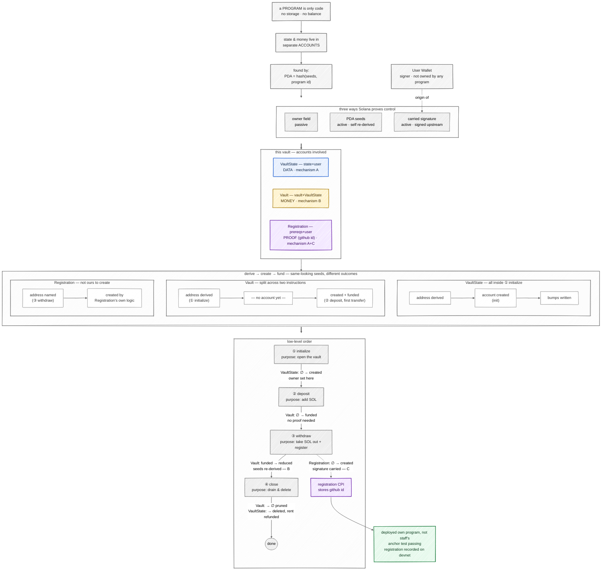

# Video prep — first principles, low-level detail, and a script

This is not the Task 3 deliverable — see [`ARCHITECTURE.md`](./ARCHITECTURE.md)
for that. This file is deeper prep material: the reasoning behind the
architecture, worked through from first principles, plus a script for
walking through `ARCHITECTURE.md` on camera. Task 4 explicitly allows the
video to explain more than the diagram shows, so this is where that
extra depth lives.

---

## Script — for narrating the two ARCHITECTURE.md diagrams on camera

This is the actual video script. It's built around the component/account
map and the sequence diagram in `ARCHITECTURE.md` — the diagrams above are
your own background, not what's on screen. Ordered to explicitly hit all
four Task 1 points (purpose of each instruction, accounts involved, state
over time, overall flow) plus the Task 2 extension. Timed to land around
2:45, inside the 3-minute cap.

### 0 — open (8s)

> "This is a Solana vault program — deposit and withdraw SOL through a
> PDA, plus one cross-program call I added for this challenge. Two
> diagrams: accounts first, then the flow."

### 1 — diagram 1: accounts involved (~40s)

> "A Solana program only ever holds code — never storage, never a balance
> of its own — so it's handed separate accounts for everything it needs
> to remember.
>
> `VaultState` is bookkeeping — just two PDA bumps — owned by the Vault
> Program itself, so only my program can write to it.
>
> `Vault` is the money. It holds the deposited SOL, but it's owned by the
> *System* Program, not by me — because it carries no custom data at all,
> just a balance.
>
> `Registration` belongs to a completely different program. I only supply
> its address and a github id; the Registration program's own logic
> actually creates and owns that account.
>
> Two CPIs leave the Vault Program: one to the System Program, on every
> SOL movement, and one to the Registration program, only during
> withdraw."

### 2 — diagram 2: purpose, state over time, and overall flow (~75s)

> "Now the sequence, instruction by instruction.
>
> `initialize` opens the vault. Under the hood that's a CPI to the System
> Program that creates `VaultState` — Anchor generates that automatically
> from the `init` constraint, I don't write it myself. After this,
> `VaultState` exists, owned by my program, holding two bumps.
>
> `deposit` moves SOL from the user into `Vault`. No special proof is
> needed — the user's just spending their own money. This transfer is
> also what actually brings the `Vault` account into existence — before
> this, it was only ever a derived address, nothing real sitting there.
>
> `withdraw` is the interesting one — it makes two calls. First, it moves
> SOL from `Vault` back to the user. `Vault` has no private key, so the
> program re-supplies the exact seeds that derived it to prove authority.
> Second — the part I added — it calls the Registration program. No seeds
> needed there at all, because the user's signature from the outer
> transaction carries straight through the CPI.
>
> Finally, `close` drains whatever's left in `Vault`, deletes
> `VaultState`, and refunds its rent to the user."

### 3 — the Task 2 extension (~35s)

> "Before I touched anything, `withdraw` already declared an
> `application_account` and an `application_program` — present in the
> struct, completely unused. That's the assignment's own hint for what
> came next. What I added was the actual call: a CPI into the
> Registration program's `initialize`, passing my github id. I deployed
> this under my own program ID, not the one the course provided — so the
> CPI can't be mistaken for a direct call to Registration, or a call
> routed through the staff's program."

### 4 — proof of work (~20s)

> "I verified this on devnet: `anchor test` passes end to end, and the
> withdrawal transaction itself shows the registration account going from
> not existing to holding my github id — in the same transaction as the
> SOL leaving the vault. That's the success criteria the assignment asks
> for, confirmed on-chain, not just in test output."

**Total: ~460 words, ~2:45 at a measured pace.** Practice it once against a
timer — if you're running long, section 2 is the safest place to trim,
since sections 3 and 4 are the parts a grader is most likely checking for.
